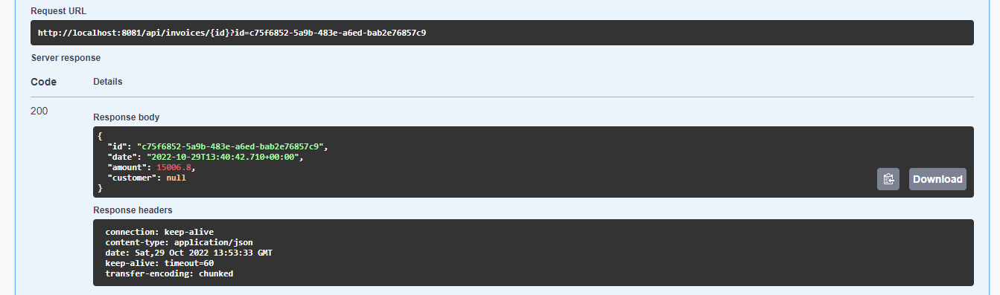

<h1 align="center">Mohamed ELYOUSFI</h1>
<h3 align="center"><💻 Mise en oeuvre d'une architecture Micro-Services 💻/></h3>  

    

        <a href="">Notes de cours</a>
        <h5>Selected Dependencies</h5>
        <ul>
            <li>
                Spring Web.
            </li>
            <li>
                Spring Data JPA.
            </li>
            <li>
                H2 Database.
            </li>
            <li>
                Rest Repositories.
            </li>
            <li>
                Lombok.
            </li>
            <li>
                Spring Boot DevTools.
            </li>
            <li>
                Eureka Discovery Client.
            </li>
            <li>
                Spring Cloud OpenFeign.
            </li>
            <li>
                Spring Boot Actuator : let you monitor and manage your application
            </li>
            <li>
                Mapstruct.
            </li>
            <li>
                Swagger-Ui.
            </li>
        </ul> 
        <h3>1. CUSTOMER-SERVICE</h3>
        <h5>1.1. Création de l'entité Customer</h5>
        
        <h5>1.1. Création du repository Customer</h5>
        
        <h5>1.2. Création du CustomerRequestDTO</h5>
        
        <h5>1.3. Création du CustomerResponseDTO</h5>
        
        <h5>1.4. Création du CustomerMapper</h5>
        
        <h5>1.5. Création du CustomerService et Impl</h5>
        
        
        
        <h5>1.6. Création du CustomerController</h5>
        
        <h5>1.7. Insertion des données de test</h5>
        
        
        
        <h5>1.8. Monitoring du MS</h5>
        
        <h5>1.9. Swagger</h5>
        <h6>Documentation de l'API</h6>
        
        <h6>Test de l'API - getAllCustomers</h6>
        
        <h6>Test de l'API - addCustomer</h6>
        
        
        <h3>2. BILLING-SERVICE</h3>
        <h5>2.1. Création de l'entité Invoice et Customer</h5>
        
        
        <h5>2.2. Création du repository Invoice</h5>
        
        <h5>2.3. Création du InvoiceRequestDTO</h5>
        
        <h5>2.4. Création du InvoiceResponseDTO</h5>
        
        <h5>2.5. Création du InvoiceMapper</h5>
        
        <h5>2.6. Création du InvoiceService et Impl</h5>
        
        
        
        
        <h5>2.7. Création du InvoiceController</h5>
        
        <h5>2.8. Insertion des données de test</h5>
        
        
        
        <h5>2.9. Monitoring du MS</h5>
        
        <h5>2.10. Swagger</h5>
        <h6>Documentation de l'API</h6>
        
        <h6>Test de l'API - getAllInvoices</h6>
        
        <h6>Test de l'API - getInvoiceById</h6>
        

<!--  -->
